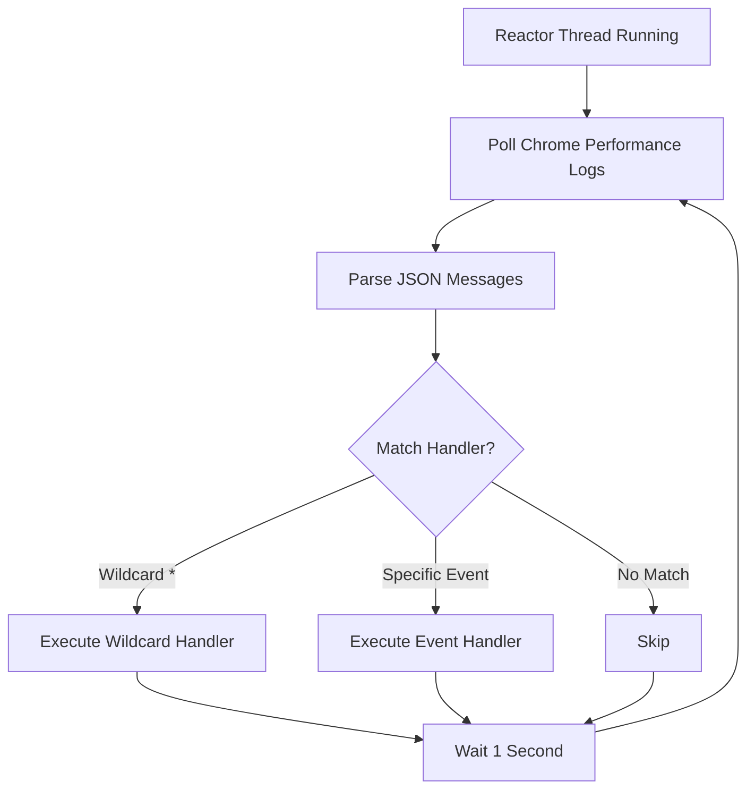

## Overview

The `Reactor` class is a background thread that continuously monitors and processes Chrome DevTools Protocol (CDP) events. It runs asynchronously to capture network traffic, console messages, and other browser events without blocking your main automation code.

## How It Works

When you enable CDP events, Undetected automatically creates and starts a Reactor:

```python
import undetected as uc

driver = uc.Chrome(enable_cdp_events=True)
# A Reactor instance is automatically created and started
# Available at: driver.reactor
```

The Reactor:
1. Runs as a daemon thread in the background
2. Polls Chrome's performance logs every second
3. Parses CDP messages from the logs
4. Executes registered callbacks for matching events
5. Handles all events asynchronously without blocking

## Class Definition

The Reactor is defined in `reactor.py:11` and inherits from `threading.Thread`:

```python
class Reactor(threading.Thread):
    def __init__(self, driver: "Chrome"):
        super().__init__()
        
        self.driver = driver
        self.loop = asyncio.new_event_loop()
        self.lock = threading.Lock()
        self.event = threading.Event()
        self.daemon = True
        self.handlers = {}
```

### Attributes

| Attribute | Type | Description |
|-----------|------|-------------|
| `driver` | Chrome | Reference to the Chrome driver instance |
| `loop` | asyncio.EventLoop | Async event loop for processing events |
| `lock` | threading.Lock | Thread-safe lock for accessing handlers |
| `event` | threading.Event | Event flag for thread shutdown |
| `daemon` | bool | Daemon thread (exits when main program exits) |
| `handlers` | dict | Mapping of event names to callback functions |

## Registering Event Handlers

### Method: add_event_handler

```python
reactor.add_event_handler(method_name: str, callback: callable) -> None
```

Registers a callback function for a specific CDP event.

**Parameters:**
- `method_name` (str): CDP event name (e.g., "Network.responseReceived")
- `callback` (callable): Function accepting one parameter - the message dictionary

**Example:**

```python
import undetected as uc

def handle_response(message):
    params = message.get('params', {})
    response = params.get('response', {})
    print(f"Status: {response.get('status')} - {response.get('url')}")

driver = uc.Chrome(enable_cdp_events=True)

# Access the reactor directly
driver.reactor.add_event_handler("network.responsereceived", handle_response)

# Or use the convenience method
driver.add_cdp_listener("Network.responseReceived", handle_response)

driver.get("https://example.com")
```

<Note>
Event names are automatically converted to lowercase, so "Network.responseReceived" and "network.responsereceived" are equivalent.
</Note>

## Event Processing Flow

The Reactor processes events through this flow:



## Core Methods

### run()

The main thread entry point that starts the async event loop:

```python
def run(self):
    try:
        asyncio.set_event_loop(self.loop)
        self.loop.run_until_complete(self.listen())
    except Exception as e:
        logger.warning("Reactor.run() => %s", e)
```

This method is called automatically when the Reactor thread starts.

### listen()

Async method that continuously polls for CDP events:

```python
async def listen(self):
    while self.running:
        await self._wait_service_started()
        await asyncio.sleep(1)
        
        try:
            with self.lock:
                log_entries = self.driver.get_log("performance")
            
            for entry in log_entries:
                try:
                    obj_serialized: str = entry.get("message")
                    obj = json.loads(obj_serialized)
                    message = obj.get("message")
                    method = message.get("method")
                    
                    if "*" in self.handlers:
                        await self.loop.run_in_executor(
                            None, self.handlers["*"], message
                        )
                    elif method.lower() in self.handlers:
                        await self.loop.run_in_executor(
                            None, self.handlers[method.lower()], message
                        )
                except Exception as e:
                    raise e from None
        except Exception as e:
            if "invalid session id" in str(e):
                pass
            else:
                logging.debug("exception ignored :", e)
```

The method:
- Waits for Chrome service to be ready
- Fetches performance logs from Chrome
- Parses each log entry as JSON
- Executes matching handlers asynchronously
- Handles exceptions gracefully

### running Property

```python
@property
def running(self):
    return not self.event.is_set()
```

Returns `True` if the Reactor is actively processing events.

## Thread Safety

The Reactor uses thread-safe mechanisms to prevent race conditions:

```python
# Thread-safe handler registration
def add_event_handler(self, method_name, callback: callable):
    with self.lock:
        self.handlers[method_name.lower()] = callback

# Thread-safe log retrieval
with self.lock:
    log_entries = self.driver.get_log("performance")
```

All access to shared resources is protected by locks.

## Wildcard Handler

You can register a wildcard handler to receive all CDP events:

```python
import undetected as uc
import json

def log_all_events(message):
    method = message.get('method')
    print(f"Event: {method}")

driver = uc.Chrome(enable_cdp_events=True)
driver.reactor.add_event_handler("*", log_all_events)

driver.get("https://example.com")
```

When a wildcard handler is registered, it receives every CDP event before specific handlers are checked.

## Stopping the Reactor

The Reactor stops automatically when the driver quits:

```python
driver.quit()  # Automatically stops the reactor
```

The cleanup process in `__init__.py:732`:

```python
try:
    self.reactor.event.set()
    logger.debug("shutting down reactor")
except AttributeError:
    pass
```

Setting `reactor.event` causes the `running` property to return `False`, stopping the listen loop.

## Performance Considerations

### Polling Interval

The Reactor polls Chrome logs every 1 second:

```python
await asyncio.sleep(1)
```

This provides a good balance between responsiveness and CPU usage.

### Async Execution

Callbacks are executed asynchronously using `run_in_executor`:

```python
await self.loop.run_in_executor(
    None, self.handlers[method.lower()], message
)
```

This prevents slow callbacks from blocking event processing.

### Memory Management

The Reactor is a daemon thread that:
- Automatically exits when the main program ends
- Doesn't prevent program shutdown
- Releases resources when the driver quits

## Example: Advanced Event Processing

```python
import undetected as uc
import time
from collections import defaultdict

class EventAnalyzer:
    def __init__(self):
        self.event_counts = defaultdict(int)
        self.start_time = time.time()
    
    def handle_all_events(self, message):
        """Count all CDP events by type"""
        method = message.get('method')
        self.event_counts[method] += 1
    
    def print_statistics(self):
        """Print event statistics"""
        elapsed = time.time() - self.start_time
        print(f"\nEvent Statistics ({elapsed:.1f}s):")
        print("-" * 50)
        
        for method, count in sorted(
            self.event_counts.items(), 
            key=lambda x: x[1], 
            reverse=True
        ):
            print(f"{method:40} {count:>5}")
        
        total = sum(self.event_counts.values())
        print("-" * 50)
        print(f"Total events: {total}")

# Usage
analyzer = EventAnalyzer()

driver = uc.Chrome(enable_cdp_events=True)
driver.reactor.add_event_handler("*", analyzer.handle_all_events)

driver.get("https://example.com")
time.sleep(3)  # Let events process

analyzer.print_statistics()
driver.quit()
```

## Debugging

Enable debug logging to see Reactor activity:

```python
import logging
import undetected as uc

logging.basicConfig(level=logging.DEBUG)

driver = uc.Chrome(enable_cdp_events=True)
print(f"Reactor running: {driver.reactor.running}")
print(f"Registered handlers: {list(driver.reactor.handlers.keys())}")
```

## See Also

- [CDP Events](/advanced/cdp-events) - Using add_cdp_listener method
- [CDP Class](/api/cdp) - Direct CDP interface
- [Chrome Class](/api/chrome) - Main driver class
